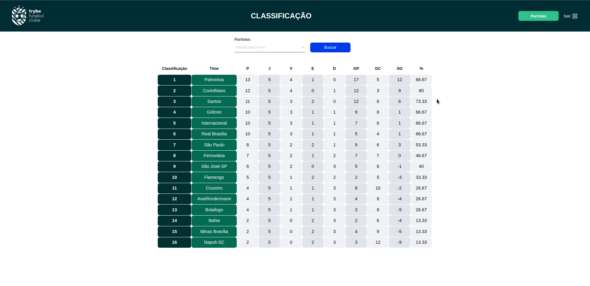

# ⚽️ Projeto Futebol Clube! ⚽️


# :computer: Projeto

O app Futebol Clube, é uma aplicação que simula a classificação de times em um campeonato de acordo com o resultado das partidas. Teve como objetivo desenvolver uma API REST de placares de partidas de futebol utilizando Node.js, express, sequelizeORM e JWT. A aplicação foi feita usando o método TDD (Desenvolvimento Orientado a Testes) juntamento com POO (programação orientada a objetos), ela está totalmente dockerizada, tanto no front end quanto no back end, pois é uma aplicação web full stack, onde o front end já havia sido desenvolvido pela Trybe inicialmente. Os testes de integração foram feitos utilizando mocha e chai, e a biblioteca sinon para realizar os mocks das funções.

---

## :construction_worker_man: Tecnologias Utilizadas


* Express
* Typescript
* Sequelize - MySql
* Nodejs
* Docker
* Conceitos de POO
* Testes de integração com:
  - mocha
  - chai
  - sinon

## :man::computer: O que foi Desenvolvido

Aplicação dockerizada em `Node.js + Typescript` usando o pacote `sequelize`.


## :play_or_pause_button: O que precisa para rodar a aplição

 - Ambiente node configurado
 - docker e docker-compose instalados em maquina
 - OBS : O seu docker-compose precisa estar na versão 1.29 ou superior.

## Caso não tenha o docker e docker-compose instalados e deseje fazer a instalação, siga os passos abaixo:

### :whale: Instalação do docker(via repositórios) e docker-compose no Ubuntu (tutorial para versão Ubuntu 20.04.3 LTS)

  ### :construction_worker_man: Desinstalando versões anteriores.
  
  1 - Versões mais antigas do Docker eram chamadas de `docker`, `docker.io`, ou `docker-engine`. Se estes estiverem instalados, desinstale-os:
  
  ```
  sudo apt-get remove docker docker-engine docker.io containerd runc
  ```


### :construction_worker_man::rocket: Instalação usando o repositório.
> Antes de instalar o Docker Engine pela primeira vez em uma nova máquina host, você precisa configurar o repositório do Docker. Depois, você pode instalar e atualizar o Docker a partir do repositório.


  ### :man_technologist: Configurar o repositório.
  
  :one: Atualize o `apt` índice de pacotes executando o seguinte comando no seu terminal :

  ```
  sudo apt-get update
```

  :two: Instale pacotes para permitir que o `apt` faça uso do repositório por HTTPS:
  
  ```
  sudo apt-get install \
    apt-transport-https \
    ca-certificates \
    curl \
    gnupg \
    lsb-release
  ```

  :three: Adicione a chave GPG oficial do Docker

  ```
  curl -fsSL https://download.docker.com/linux/ubuntu/gpg | sudo gpg --dearmor -o /usr/share/keyrings/docker-archive-keyring.gpg
  ```
  ``
  Obs: Se tudo correr bem, você não deve receber nenhum retorno visual.
  ``

  :four: Use o comando a seguir para configurar o repositório **estável**:

  ```
  echo \
  "deb [arch=$(dpkg --print-architecture) signed-by=/usr/share/keyrings/docker-archive-keyring.gpg] https://download.docker.com/linux/ubuntu \
  $(lsb_release -cs) stable" | sudo tee /etc/apt/sources.list.d/docker.list > /dev/null
  ```
  
### :whale: Instalando Docker Engine.
  
  :one: Atualize o `apt` índice de pacotes e instale a versão mais recente do Docker Engine e do containerd:

  ```
  sudo apt-get update
  ```
  em seguida:
  
  ```
  sudo apt-get install docker-ce docker-ce-cli containerd.io
  ```
  ---

### :whale: Instalação do docker-compose.

  ##### :man_technologist: Instalação.

  :one: Execute este comando para baixar a versão estável atual do Docker Compose:

  ```
  sudo curl -L "https://github.com/docker/compose/releases/download/1.29.2/docker-compose-$(uname -s)-$(uname -m)" -o /usr/local/bin/docker-compose
  ```
  :two: Aplique permissões executáveis ao binário:

  ```
  sudo chmod +x /usr/local/bin/docker-compose
  ```
  
  :three: E se tudo ocorrer bem, para validar a instalação basta executar o seguinte comando:
  
  ```
  docker-compose --version
  ```
  `Devem ser exibidos os detalhes da versão instalada em seu terminal.`
  
  ---
  
## :computer: Após feita a instalação do Docker e Docker-compose, é hora de clonar a aplicação para sua máquina.


  ## :man_technologist: Baixar e installar as depedências
   ```
   git clone git@github.com:Mathluiz23/futebol-clube.git
   ```
   
   ```
   cd futebol-clube/app
   ```
   ```
   npm install
   ```
  ---
  ## :man_technologist: Executar a aplicação
  #### No diretorio /app execute o comando
  ```
  npm run compose:up
  ```
  ## Parar a aplicação
  #### No diretorio /app execute o comando
  ```
  npm run compose:down
  ```
  ## Rodar testes
  #### No diretorio /app execute o comando
  ```
  cd /backend
  ```
  ```
  npm test
  ```

# :checkered_flag::man_technologist: Como rodar o projeto localmente:
 
   ## 💻 Frontend
    - Entre no diretório "frontend" `cd app/frontend` e execute o comando `npm start` para iniciar o front end da aplicação.
    - Ou acesse o seu navegador no endereço [http://localhost:3000/leaderboard]

   ## 🧙‍♂️🗂️ Backend:
    - Mude o nome do arquivo ".env.example" para ".env" e preencha com as informações do seu usuario MySQL
    - Case não tenha o MySql instalado, siga o [Tutorial](https://www.alura.com.br/artigos/mysql-do-download-e-instalacao-ate-sua-primeira-tabela?gclid=Cj0KCQjw06OTBhC_ARIsAAU1yOXB1KimL-aPJ6uv3yx6-rOoWZ5AGiEr4ewdQNHQNuy1IphJU_mO77kaAn3qEALw_wcB)
    - Entre no diretório "backend" `cd app/backend` e execute o comando `npm start` para iniciar o back end da aplicação
    - O backend será iniciado no endereço localhost:3001

  
## :door: :unlock: Login na aplicação

- Para manipular as partidas( adicionar ou editar ) você precisa fazer login na aplicação
- email: admin@admin.com
- password: secret_admin

  ## :arrow_forward: Demonstração da aplicação rodando




